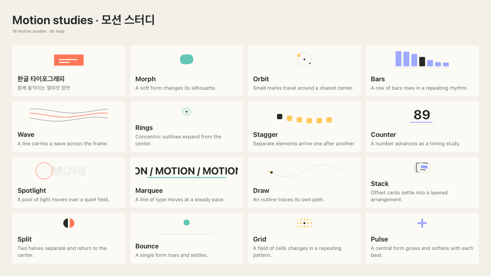

# MotionBoard Studio for macOS

A local macOS editor for making boards of looping motion studies. Edit a board, preview its shared timeline, and export a still, a silent video, or a standalone HTML page.

This is the initial 0.1.0 implementation. Native rendering and export have passed automated checks. Manual editor acceptance remains pending; there is no notarized distribution release.



## What it does

- Arrange 1–16 tiles with sixteen original Canvas effects.
- Edit each tile's title, description, effect, and accent color; add, remove, and reorder tiles.
- Play, pause, and seek one shared loop from 2 to 30 seconds.
- Choose landscape, square, or portrait output and 24, 30, or 60 fps for video.
- Save and reopen editable JSON projects.
- Recover the last local draft after closing the app; incomplete text edits are retained.
- Copy a project-aware prompt to use in your own AI tool, then import the returned JSON.
- Export at a selected long edge of 720, 1280, or 1920 pixels.

| Export | Contents |
| --- | --- |
| HTML | One offline page with the renderer, project data, playback, and seeking |
| PNG | The selected timeline frame |
| MP4 | Silent H.264 video encoded with AVFoundation; optional four-sample motion blur |

The editor uses native SwiftUI controls and a WKWebView Canvas preview. Editing and exporting need no account, API key, network connection, or external package dependency. Current editor labels are in Korean; the exported HTML playback controls are in English.

## Run locally

Requirements: macOS 14 or later and a Swift 6 or later toolchain with Apple's developer tools. Node.js with its built-in test runner is needed only for the renderer tests.

Open `Package.swift` in Xcode and run the `MotionBoardStudio` executable, or run this from the checkout root:

```sh
swift run MotionBoardStudio
```

To create a local app bundle:

```sh
scripts/build-app.sh
```

The script creates `dist/MotionBoard Studio.app` with a local ad-hoc signature. It refuses to replace an existing app; pass a new destination as its first argument for another build. Apple Developer ID signing and notarization are not included.

If the active developer directory points to Command Line Tools, use `DEVELOPER_DIR=/Applications/Xcode.app/Contents/Developer` for Swift/Xcode commands. The two scripts select that installed Xcode automatically without changing the global developer-directory setting.

## Make a board

1. Start with the example board and select a tile in the sidebar.
2. Edit its text, choose an effect, and adjust its accent in the inspector. Use the sidebar controls to add, remove, or move tiles.
3. Set the board title, aspect ratio, loop duration, and video frame rate.
4. Play the board or drag the timeline to inspect a frame.
5. Save the JSON to continue editing later, or choose an export format from the toolbar.

For AI-assisted composition, the **AI prompt** toolbar action copies a format guide and the current board to the clipboard. Paste it into your chosen tool, save its JSON response as a `.json` file, and open that file in the app. The app does not connect to an AI account or submit the prompt itself. Generated projects must follow the [project format](docs/PROJECT-FORMAT.md).

Try the [example project](examples/motion-study.json), or download [its standalone HTML board](examples/motion-study.html) and open it in a browser. The app stores its recovery draft in `~/Library/Application Support/MotionBoardStudioMac/draft.json`; use Save to keep a named project file.

## Development and verification

```sh
swift test
node --test Tests/board-runtime.test.cjs
scripts/verify-render.sh
```

The Swift core contains document validation and frame scheduling. The JavaScript runtime contains layout, time normalization, and effect rendering. Native preview and export verification require a usable macOS graphical session. Passing unit tests alone does not establish native UI or export acceptance.

Verified locally: 17 Swift tests, 8 JavaScript tests, deterministic native WebKit PNGs in three aspect ratios, a 48-frame H.264 export with checked playback timestamps, fractional duration with four-sample blur, and in-flight cancellation that preserves an existing file. See [validation details and limits](docs/VALIDATION.md).

## Current scope

MP4 export is silent. Audio import, beat synchronization, provider account integration, and distribution notarization remain future work. The current project format selects the bundled effects; it does not import arbitrary HTML, JavaScript, fonts, or media assets.

See the [roadmap](docs/ROADMAP.md) for subsequent milestones and the [inspiration notes](docs/INSPIRATION.md) for the public reference and source boundaries. This is an original implementation, not a licensed fork of the separately assessed Windows application.

## Contributing and license

Use [repository Issues](https://github.com/lucasung-debug/MotionBoardStudio-macOS/issues) for bug reports and proposed changes. Include the macOS version, reproduction steps, and expected behavior; use a minimal synthetic project when sharing an example.

Original project code is available under the [MIT License](LICENSE). The license does not cover the linked reference article or its downloadable kit. Third-party assets retain their own licenses, and users retain their rights to their own assets.
