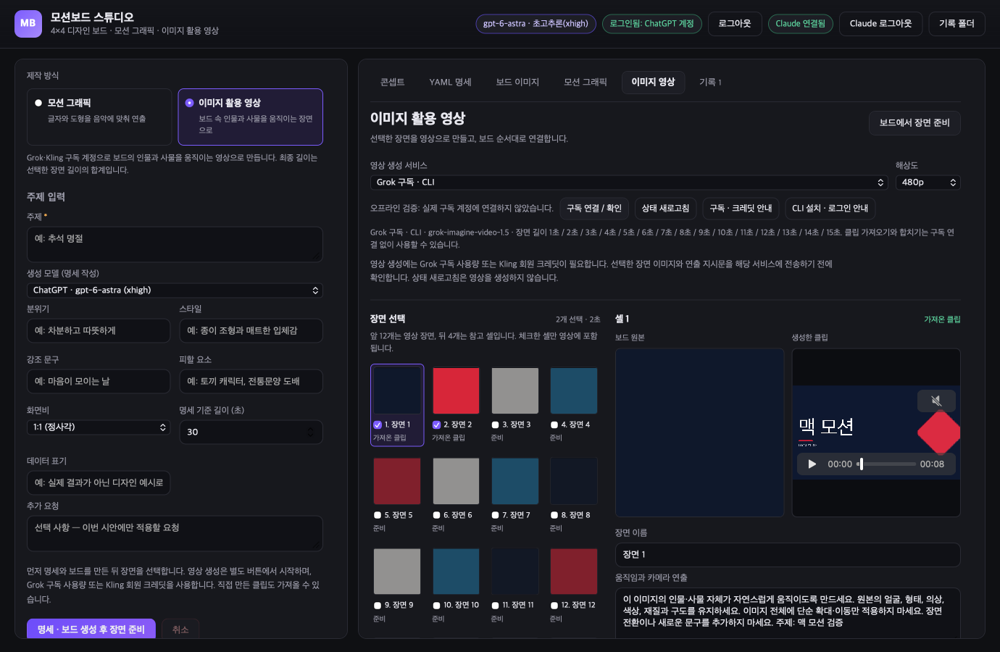

# MotionBoard Studio for macOS

제작자가 제공한 **MotionBoardStudio 0.3.2** 소스를 바탕으로 만든 macOS 앱입니다. 원작의 주제 → 명세 → 디자인 보드 → 모션 그래픽 흐름을 유지하고, 보드 속 인물과 사물이 움직이는 **이미지 활용 영상** 제작 경로를 추가했습니다.

Swift 앱이 WebKit 화면을 띄우고, 로컬 Node.js 프로세스가 제작 로직을 실행합니다. 키체인, 파일 선택, 미디어 제공, 화면 캡처는 Swift에서 처리합니다. Electron은 필요하지 않습니다. JavaScript 제작 엔진을 유지한 Swift 호스트 구조입니다.

**현재 상태:** 공개된 DMG는 기존 **0.3.2-mac.3**입니다. 새 이미지 활용 영상 기능은 개발 중인 소스에 구현되어 있으며, 이 공개 DMG에는 포함되어 있지 않습니다. 현재 소스의 새 영상 요청은 Grok 공식 CLI의 구독 로그인과 Kling 공식 CLI의 회원 계정 MCP를 사용합니다. API 키를 입력하는 경로는 새 생성에 사용하지 않습니다. **구독 계정을 통한 실제 영상 생성과 결과 품질 검증은 아직 하지 않았습니다.** 기존 이미지 분할·MP4 합성 검증은 실제 로컬 FFmpeg로 수행했습니다.

기존 모션 그래픽 경로는 ChatGPT 명세·보드 생성, Claude 연출·프레임 점검, Mixkit 음악 선택, 네이티브 렌더링과 기록 저장을 실계정으로 확인했습니다. 당시 결과는 1440×1440, 60fps, 8.8초 H.264/AAC 영상입니다. 이 기록이 새 이미지 영상 서비스의 실계정 검증을 대신하지는 않습니다.



*개발본 8의 1380×900 네이티브 WebKit 검증 이미지입니다. 계정 표시는 테스트 데이터이고, 보드는 합성 색상표, 클립은 로컬 테스트 영상입니다. Grok·Kling이 생성한 결과를 보여 주는 이미지는 아닙니다.*

## Mac에 설치

[0.3.2-mac.3 릴리스](https://github.com/lucasung-debug/MotionBoardStudio-macOS/releases/tag/v0.3.2-mac.3)에서 Apple Silicon용 DMG를 받으세요. 열어서 **MotionBoard Studio.app**을 **Applications**로 드래그한 다음, 디스크를 추출하고 응용 프로그램 폴더의 앱을 실행합니다. macOS 14 이상이 필요합니다. Node.js와 FFmpeg를 포함하므로 설치받는 사람에게 Homebrew나 개발 도구가 필요하지 않습니다.

현재 배포본은 무료 배포 방식을 유지하며 ad-hoc 서명만 적용되어 있습니다. **Apple 공증은 받지 않았습니다.** 처음 실행할 때 macOS가 차단하면 다운로드 출처를 확인한 뒤 **시스템 설정 → 개인정보 보호 및 보안 → 그래도 열기**에서 허용할 수 있습니다. 자세한 절차는 [Apple 공식 안내](https://support.apple.com/ko-kr/102445)를 참고하세요. Developer ID 서명·공증과 Intel용 배포는 완료되지 않았습니다.

명세 생성에는 앱에서 ChatGPT 또는 Claude 로그인이 필요하고, 자동 보드 이미지 생성에는 ChatGPT 로그인이 필요합니다. 설치 파일에는 계정 정보와 사용자의 생성물이 들어 있지 않습니다. **공개된 mac.3 DMG는 모션 그래픽 경로를 제공합니다.** 아래 두 제작 경로를 함께 사용하려면 현재 소스의 개발본을 실행하세요.

개발본에서 Grok·Kling으로 영상을 생성하려면 해당 공식 CLI를 별도로 설치하고 구독 계정을 연결해야 합니다. CLI는 앱·DMG에 포함하지 않습니다. 설치 방법은 [Grok Build](https://docs.x.ai/build/overview)와 [Kling 공식 CLI·스킬](https://github.com/klingai-tech/skills)을 참고하세요. Kling CLI npm 패키지는 라이선스가 명시되지 않아 번들로 재배포하지 않습니다.

## 두 가지 제작 경로

| 화면에서 선택 | 만드는 영상 | 보드 사용 방식 |
| --- | --- | --- |
| **모션 그래픽** | 글자·도형·색과 음악을 이용한 연출 | 명세, 팔레트, 문구를 참고해 구성 |
| **이미지 활용 영상** | 원본 속 인물·사물이 움직이는 장면을 연결한 영상 | 보드를 실제 이미지로 잘라 Grok·Kling에 전달하거나, 직접 만든 클립을 가져와 사용 |

모션 그래픽은 주제와 분위기 등을 입력하고 명세·보드를 만든 뒤, 연출 엔진 또는 실험적인 HTML/CSS/JavaScript 경로로 렌더링합니다. 음악 자동 선택·내 음악 파일·효과음, 프레임 점검과 수정, 기록 저장·다시 열기·MP4 저장을 지원합니다. 초안은 30fps, 최종 렌더는 60fps와 4개 서브프레임 모션 블러를 사용합니다.

이미지 활용 영상은 **보드에서 장면 준비 → 장면 선택·움직임 편집 → 구독 연결 / 확인 → 생성 요청 → 상태 확인 → 원본과 비교 → MP4 합치기** 순서입니다. 16개 셀 중 앞 12개를 처음에 선택하며, 사용할 셀과 장면 이름·길이·움직임 설명을 바꿀 수 있습니다. 생성은 Grok 구독 사용량 또는 Kling 회원 크레딧을 사용합니다. 선택한 이미지·지시문을 전송하기 전에 서비스와 장면 수·길이·해상도를 확인합니다.

**구독 연결 / 확인**에서 로그인 터미널을 열 수 있습니다. Grok은 앱 전용 `GROK_HOME`에서 `grok login --oauth`로 로그인하고 API 키 인증을 끕니다. 기존 Grok CLI의 로그인 정보를 읽어 복사하지 않습니다. Kling은 공식 CLI가 브라우저 OAuth 로그인을 관리하며, 현재 대화의 MCP 연결과 별도로 로그인합니다. 로그인 후 **상태 새로고침**으로 연결을 확인하고, Kling의 회원 등급·잔여 크레딧을 볼 수 있습니다. **앱에서 연결 해제**는 이 앱의 사용만 중지하며 CLI에서 로그아웃하지 않습니다.

Grok CLI Imagine의 `reference_to_video`는 장면당 1~15초와 480p·720p를 사용합니다. Kling의 `kling-video-v2_6`는 5초·10초와 720p·1080p를 제공하며, 현재 어댑터는 오디오 생성을 끕니다. 실제 선택지는 계정에서 확인되는 범위에 따릅니다. 이전 API로 접수한 작업은 저장된 앱 키체인 정보와 원래 경로로 상태 확인만 이어가고, 새 요청에는 API 키로 전환하는 대체 경로가 없습니다.

직접 만든 영상은 **이 장면에 클립 가져오기**로 넣을 수 있습니다. 이미 보드가 있는 기록에서 클립 가져오기와 로컬 합성은 영상 서비스 구독 연결 없이 사용할 수 있습니다. 자세한 사용법과 검증 범위는 [이미지 활용 영상 안내](docs/IMAGE-VIDEO.md)에 정리했습니다.

Remotion은 자막·도형·영상 등을 합성하는 도구로 검토할 수 있지만 현재 앱에는 추가하지 않았습니다. 현재 클립 합성은 FFmpeg가 담당합니다. Higgsfield 직접 연결은 추후 작업이며, 지금은 그곳에서 만든 영상을 파일로 가져올 수 있습니다.

## 소스에서 실행

macOS 14 이상, Swift 6 이상, Apple 개발 도구와 Node.js가 필요합니다. 소스에서 실행할 때 오디오 처리와 MP4 출력에는 별도로 설치한 macOS용 FFmpeg가 필요합니다. 앱에서 기존 실행 파일을 선택할 수도 있습니다.

Xcode에서 `Package.swift`를 열고 `MotionBoardStudio`를 선택하거나, 저장소 루트에서 실행하세요.

```sh
swift run MotionBoardStudio
```

현재 소스의 한국어 개발 화면을 실행합니다. `StudioUI/`가 실제 앱 화면이며, `upstream/`의 원본은 별도로 보존합니다.

## 로컬 앱 패키징

```sh
scripts/build-app.sh "dist/MotionBoard Studio Development.app"
scripts/build-dmg.sh "dist/MotionBoard Studio Development.app" "dist/MotionBoardStudio-development-arm64.dmg"
```

개발본은 공개 배포본과 구분되는 새 경로에 만드세요. 두 스크립트는 기존 결과물을 덮어쓰지 않으므로, 위 경로가 이미 있으면 다른 이름을 지정해야 합니다. 인수를 생략한 기본 앱 경로는 `dist/MotionBoard Studio 0.3.2-mac.3.app`입니다. 로컬 빌드는 GitHub 릴리스를 변경하거나 Apple 공증을 수행하지 않습니다.

arm64 패키지에는 공식 Node.js 24.21.0과 별도로 컴파일한 FFmpeg가 들어갑니다. FFmpeg는 GPL/nonfree 구성 요소를 제외하고 Apple VideoToolbox로 H.264를 인코딩합니다. 정확한 FFmpeg 소스·라이선스·릴리스 서명·빌드 절차도 앱에 포함합니다.

패키징과 기존 DMG의 검증 범위는 [배포 문서](docs/DISTRIBUTION.md)를 참고하세요. 나중에 서명·공증할 때 사용할 `scripts/release-macos.py`도 보관되어 있지만, 현재 무료 배포본에는 공증이 적용되지 않았습니다.

## 검증

```sh
node --test Tests/original-auth.test.cjs Tests/original-engine.test.cjs Tests/specification.test.cjs Tests/claude-activity.test.cjs Tests/original-bridge.test.cjs Tests/original-preview.test.cjs
node --test Tests/*subscription.test.cjs Tests/video-cli.test.cjs Tests/subscription-connections.test.cjs Tests/video-providers.test.cjs Tests/image-video.test.cjs Tests/studio-ui.test.cjs Tests/image-video-media.test.cjs
scripts/verify-render.sh .local/original-validation-new
```

네이티브 검증에는 새 출력 폴더, FFmpeg, 사용할 수 있는 macOS 그래픽 세션이 필요합니다. 제작 해상도로 확인하려면 `swift run MotionBoardStudio --verify-original --full-size --output .local/original-full-validation-new`를 실행합니다. 이 자동 검증은 로컬 테스트 응답을 사용하며, 키체인 검사도 별도의 가상 항목만 만듭니다.

구독 영상 검사는 모의 CLI 실행 결과를 사용하므로 실제 계정으로 영상을 생성하거나 구독 사용량·크레딧을 소비하지 않습니다. 설치·로그인 상태 조회가 성공해도 실제 영상 생성과 결과 품질까지 확인된 것은 아닙니다.

이미지 영상 미디어 검증은 공개 mac.3 앱의 번들 FFmpeg·ffprobe를 사용해 실제 합성 이미지를 16장으로 자르고, 움직이는 테스트 클립을 H.264/AAC로 합칩니다. 해당 번들이 없으면 미디어 통합 검사는 건너뛰므로 출력의 `skipped`를 확인하세요. 자세한 실행 조건과 결과는 [이미지 영상 검증 범위](docs/IMAGE-VIDEO.md#검증-범위)에 있습니다.

기존 제작 경로의 네이티브 렌더·취소 복구·재생·탐색·실계정 검증은 [ORIGINAL-VALIDATION.md](docs/ORIGINAL-VALIDATION.md)에, 공개 mac.3 설치본의 57개 테스트와 실제 렌더 결과는 [DISTRIBUTION.md](docs/DISTRIBUTION.md)에 기록했습니다. 이 과거 기록은 구독 CLI 전환의 검증 결과가 아닙니다. Grok·Kling 구독 계정의 실생성 검증은 아직 남아 있습니다.

현재 개발본은 명세 응답의 JSON 줄바꿈 오류를 복구하고, 그 외 형식 오류는 같은 서비스·모델에 한 번만 보정을 요청합니다. 잘린 응답과 인증 오류는 따로 표시하며 불완전한 명세는 저장하지 않습니다. 수정 내용과 검증 기록은 [명세 응답 처리](docs/SPECIFICATION-RECOVERY.md)에 있습니다. 이 수정도 기존 공개 mac.3 DMG에는 포함되어 있지 않습니다.

Claude 명세 작성에는 같은 Opus 5.5의 **작성 속도**를 선택할 수 있습니다. 기본값은 **균형**이며, 요청 접수·검토·본문 수신 상태와 경과 시간을 표시합니다. 응답 대기 상한은 빠르게·균형 5분, 깊게 10분, 더 깊게·최대 15분입니다. 연결 유지 신호가 계속 와도 이 상한은 늘어나지 않습니다. 이미 전송한 요청에는 속도 변경이 소급 적용되지 않습니다.

## 소스 구성

| 위치 | 역할 |
| --- | --- |
| `upstream/MotionBoardStudio-0.3.2/` | 수정하지 않고 보존하는 원작 UI·가이드·서비스 클라이언트·제작 엔진 |
| `StudioUI/` | 원작 화면을 바탕으로 두 제작 경로와 장면 작업 화면을 추가한 앱 UI |
| `Sources/MotionBoardOriginal/` | Swift 앱, WebKit 연결, 네이티브 기능, 키체인, 화면 캡처 |
| `Runtime/` | Node 작업 프로세스, 인증·기록, 기존 렌더링, 영상 서비스 연결, 클립 합성 |
| `preview/` | 데스크톱 기능 없이 기존 화면을 확인하는 브라우저 어댑터 |
| `Sources/MotionBoardStudio/` | 초기에 만든 별도 타일 편집기 프로토타입 |
| `docs/` | 출처, 포팅·배포 상태, 사용법, 범위를 구분한 검증 기록 |

초기 타일 편집기는 `swift run MotionBoardPrototype`으로 실행할 수 있습니다. `swift test`와 `Tests/board-runtime.test.cjs`, 이전 [검증 기록](docs/VALIDATION.md)과 [JSON 형식](docs/PROJECT-FORMAT.md)은 이 프로토타입 범위의 자료입니다.

`node scripts/preview-original.cjs`는 기존 화면의 별도 로컬 브라우저 미리보기입니다. 로그인·생성 기능은 연결하지 않으며, 새 제작 경로는 네이티브 앱에서 사용합니다.

## 참고 자료와 라이선스

[로드맵](docs/ROADMAP.md)에 기존 포팅의 남은 작업을, [이미지 영상 안내](docs/IMAGE-VIDEO.md)에 새 경로의 한계를 정리했습니다. Charlie Hills의 [모션 그래픽 글](https://charliehills.substack.com/p/opus-55-motion-graphics)은 디자인 참고 자료입니다. [INSPIRATION.md](docs/INSPIRATION.md)에서 참고 범위를 확인할 수 있습니다.

버그와 개선 제안은 [Issues](https://github.com/lucasung-debug/MotionBoardStudio-macOS/issues)에 남겨 주세요. macOS 버전·재현 순서·최소 예시를 포함하고 계정 정보는 제외해 주세요.

제작자 동의와 사용자의 공개 지시에 따라 저장소에 [MIT 라이선스](LICENSE)를 적용했습니다. 원작 표기와 소스 출처는 [SOURCE-PROVENANCE.md](docs/SOURCE-PROVENANCE.md)에 기록했습니다. 원작 GitHub 주소는 제공되지 않았으므로 GitHub의 Fork 관계로 연결된 저장소는 아닙니다. 참고 글, 음악, 폰트, 런타임 등 외부 자료에는 각각의 약관과 라이선스가 적용됩니다.
