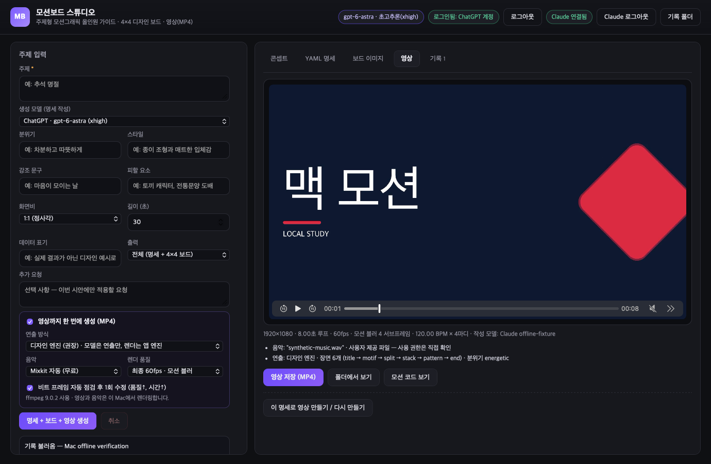

# MotionBoard Studio for macOS

A source-based macOS port of the creator-provided **MotionBoardStudio 0.3.2** application. It preserves the original topic-to-video workflow, interface, prompts, and production engine.

The Swift macOS host presents the original interface in WebKit. A local Node.js process runs the production logic; native Swift services provide Keychain access, file dialogs, asset delivery, and DOM frame capture. The macOS runtime does not require Electron. This is a Swift host with preserved JavaScript production code, not a complete rewrite of that code in Swift.

**Status:** the preserved production workflow is implemented and has passed both isolated checks and a real-account generation run. Fresh app logins were used for ChatGPT specification/board generation and Claude direction/frame review, followed by automatic Mixkit music, native rendering, and history persistence. The live result was a 1440×1440, 60 fps, 8.8-second H.264/AAC video. This is acceptance of that recorded workflow, not a guarantee for every account or generated composition.



*Native WebKit screenshot, 1380×900. Provider responses and the visible signed-in account states are local test fixtures; this image does not demonstrate real login or AI generation.*

## Production workflow

1. Enter a topic, mood, style, copy, aspect ratio, desired duration, and any exclusions.
2. Generate a production specification with ChatGPT or Claude and inspect its concept and YAML.
3. Optionally generate a 4×4 board through ChatGPT, or import an existing board image.
4. Choose automatic music selection, a local music file, or sound effects without music.
5. Use the structured direction engine or experimental generated HTML/CSS/JavaScript, with optional frame review and repair.
6. Render an MP4 with audio, reopen it from history, save the video or image, and reveal the associated composition.

The local implementation connects all 26 original `window.studio` operations, including generation, progress, cancellation, history, import, save, and reveal actions. Draft rendering uses 30 fps; final rendering uses 60 fps and four subframes for motion blur. A local full-size run produced an eight-second 1920×1080 H.264/AAC video at 60 fps. This verifies the tested production path, not every possible generated composition.

Authentication uses fresh app-specific OAuth login and macOS Keychain storage. The app does not import another application's credentials or inherit provider tokens from the environment. Login status is read locally; generation and other provider operations use the network when invoked.

## Run from source

Requirements: macOS 14 or later, a Swift 6 or later toolchain, Apple's developer tools, and Node.js. Audio processing and MP4 output also require a separate macOS FFmpeg installation. The app can locate FFmpeg or let you select an existing executable.

Open `Package.swift` in Xcode and select the `MotionBoardStudio` product, or run from the checkout root:

```sh
swift run MotionBoardStudio
```

This launches the original production application. Its current interface is in Korean.

## Local app bundle

```sh
scripts/build-app.sh
```

The default output is `dist/MotionBoard Studio Original 0.3.2.app`; pass a different destination as the first argument to preserve an existing bundle. The latest local bundle is `dist/MotionBoard Studio 0.3.2-mac.2.app`. It includes the official Node.js 24.21.0 arm64 runtime and passed ad-hoc signature verification. FFmpeg remains a separate installation or user-selected executable. Intel, clean-machine installation, Developer ID signing, and notarization have not been verified.

## Verification

```sh
node --test Tests/original-auth.test.cjs Tests/original-engine.test.cjs Tests/original-bridge.test.cjs Tests/original-preview.test.cjs
scripts/verify-render.sh .local/original-validation-new
```

Use a new output directory for native verification. The script verifies the original production app and requires FFmpeg plus a usable macOS graphical session. For production dimensions, run `swift run MotionBoardStudio --verify-original --full-size --output .local/original-full-validation-new`. Provider responses are local fixtures. A separate Keychain test creates and removes its own synthetic item; no real account credential is used.

Recorded results include 43 original-app authentication/engine/bridge checks, native production rendering with audio, three production-size DOM captures, free-code rendering, cancellation preservation, and native UI playback/seeking. The separate live run used real providers and selected music after analyzing five Mixkit candidates. Google Fonts loading was also verified with four actual FontFace entries. See [ORIGINAL-VALIDATION.md](docs/ORIGINAL-VALIDATION.md) for exact values, commands, and remaining limits.

## Project layout

| Location | Purpose |
| --- | --- |
| `upstream/MotionBoardStudio-0.3.2/` | Preserved original interface, guides, provider clients, and production engine |
| `Sources/MotionBoardOriginal/` | Swift application, WebKit bridge, native actions, Keychain, and frame capture |
| `Runtime/` | Local Node worker, original-workflow orchestration, authentication, storage, and render adapter |
| `preview/` | Browser-only adapter for inspecting the original interface without desktop services |
| `Sources/MotionBoardStudio/` | Earlier independent tile-editor prototype |
| `docs/` | Port status, provenance, roadmap, and scoped validation records |

The earlier tile editor remains available as `swift run MotionBoardPrototype`. Its `swift test` and `Tests/board-runtime.test.cjs` checks concern the prototype and shared prototype models, not original-application parity. Its older [validation record](docs/VALIDATION.md) and [JSON format](docs/PROJECT-FORMAT.md) retain that scope.

For UI inspection alone, `node scripts/preview-original.cjs` starts the separate localhost preview. Its login and generation actions remain unavailable by design; use the native product for the implemented services.

## Reference, contribution, and license

The [roadmap](docs/ROADMAP.md) separates remaining acceptance work from later workflow improvements. Charlie Hills's [motion graphics article](https://charliehills.substack.com/p/opus-55-motion-graphics) remains background design context; see [INSPIRATION.md](docs/INSPIRATION.md).

Use [Issues](https://github.com/lucasung-debug/MotionBoardStudio-macOS/issues) for reproducible bugs and proposed changes. Include the macOS version, reproduction steps, and a minimal example without account data.

The repository uses the [MIT License](LICENSE), following the creator consent and publication direction supplied by the user. Original-source attribution and origin are recorded in [SOURCE-PROVENANCE.md](docs/SOURCE-PROVENANCE.md). No original GitHub repository URL was supplied, so this is a source-based port rather than a GitHub-network fork. Linked articles, music, fonts, and other third-party assets retain their own terms.
