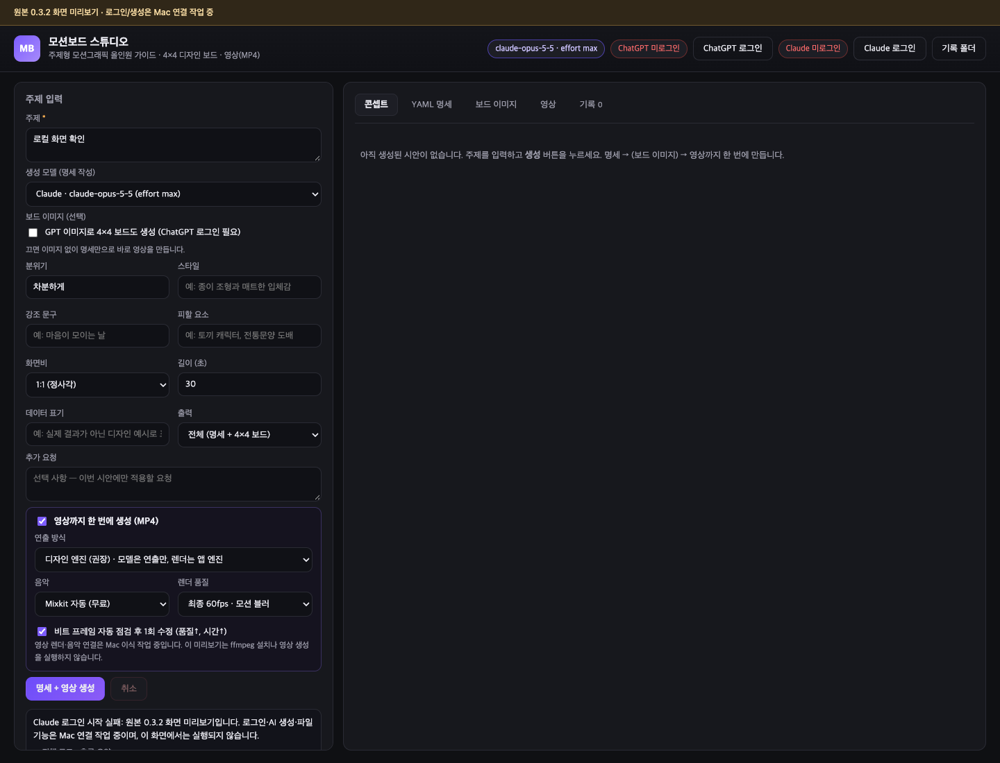

# MotionBoard Studio for macOS

A source-based macOS port of the creator-provided **MotionBoardStudio 0.3.2** Windows application. The goal is to preserve its topic-to-video workflow and move the desktop integration to Swift/Xcode.

The original application takes a topic and creative direction, generates a production specification with ChatGPT or Claude, optionally produces a 4×4 design board, and renders a music-synchronized motion video. It includes concept, YAML, image, video, and history views.

**Port status:** the original source and interface are now the baseline. The original interface can be previewed locally. Its login, generation, media, and history services still require the macOS bridge; the preview does not simulate successful generation. This is not yet a complete macOS replacement.



## Preview the original interface

Requires Node.js with its built-in HTTP server APIs. From the checkout root:

```sh
node scripts/preview-original.cjs
```

Open the localhost URL printed by the command. The preview uses the supplied renderer HTML, CSS, and JavaScript, with a browser adapter in place of Electron IPC. It supports the original tabs, form controls, model selection, and browser-local form persistence. Login and generation are explicitly unavailable here, and the preview does not contact providers or read account credentials.

The server binds only to `127.0.0.1` and serves an explicit set of preview resources. Stop it with Control-C.

Run `node --test Tests/original-preview.test.cjs` for the preview checks. Three tests passed, and the five tabs, provider switching, and form persistence were checked in an isolated browser without provider requests. See [the scoped verification record](docs/ORIGINAL-PORT.md#verification-and-next-steps).

## Source and porting boundaries

| Location | Purpose |
| --- | --- |
| `upstream/MotionBoardStudio-0.3.2/` | Preserved application source from the supplied Windows distribution |
| `preview/` and `scripts/preview-original.cjs` | Original-interface browser adapter and local preview server |
| `Sources/` | Earlier Swift/Canvas prototype; useful implementation material, not original-app parity |
| `docs/ORIGINAL-PORT.md` | Original workflow, service mapping, and remaining port work |
| `docs/SOURCE-PROVENANCE.md` | Source origin, attribution, and publication context |

The initial Swift prototype implemented a separate sixteen-tile motion editor. That was a scope mismatch: the original application is an AI production workflow, not a tile editor. The prototype is retained, but its screenshots, examples, tests, and app bundle do not establish original-application compatibility. The earlier validation record is explicitly scoped in [VALIDATION.md](docs/VALIDATION.md).

## Swift/Xcode direction

Keep the original workflow, prompts, result contracts, and motion engine. Replace Electron desktop integration with Swift services for application storage, file dialogs, media access, account state, cancellation, and rendering. WebKit can preserve the HTML/CSS/JavaScript interface and generated motion content while those services are migrated.

The [port plan](docs/ORIGINAL-PORT.md) and [roadmap](docs/ROADMAP.md) distinguish existing Windows code, local interface verification, and work still required on macOS. Provider login/streaming, original-engine capture, audio synchronization, and exported video must each be verified before claiming parity.

## Earlier prototype

The retained experimental Swift package requires macOS 14 or later and a Swift 6 toolchain. Open `Package.swift` in Xcode or run `swift run MotionBoardStudio`. **This launches the earlier tile editor, not the original production application.**

Its checks remain available:

```sh
swift test
node --test Tests/board-runtime.test.cjs
scripts/verify-render.sh
```

Use the full Xcode developer directory if needed: `DEVELOPER_DIR=/Applications/Xcode.app/Contents/Developer`. The earlier prototype's local build script is `scripts/build-app.sh`; its output is not a release of the original-app port.

## Reference, contribution, and license

Charlie Hills's [motion graphics article](https://charliehills.substack.com/p/opus-55-motion-graphics) is a design reference. Its downloadable kit was not accessed or copied. Improvements will be evaluated against the original app's workflow; see [INSPIRATION.md](docs/INSPIRATION.md).

Use [Issues](https://github.com/lucasung-debug/MotionBoardStudio-macOS/issues) for bugs and proposals. Include reproduction steps and a minimal example without account data.

This repository is published under the [MIT License](LICENSE) at the user's direction. The creator-provided source's provenance and attribution are recorded in [SOURCE-PROVENANCE.md](docs/SOURCE-PROVENANCE.md). No original GitHub repository URL was supplied, so this is a source-based port rather than a GitHub-network fork. Linked articles, external music, fonts, and other third-party assets retain their own terms.
